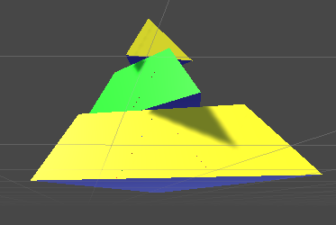
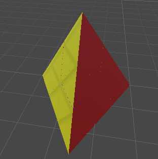

# Criação de um Piramix

Este projeto foi voltado para a criação de um piramix usando a ferramenta Unity, onde queremos rotacionar
a base, meio e topo do piramix, de acordo com cada uma de suas faces.

## Vesão do Unity

O projeto foi desenvolvido na versão `2022.3.53f1` do unity.

## Como Rotacionar o Piramix

Teclas necessárias:

- `1` (não NumPad): rotaciona em relação a face azul;
- `2` (não NumPad): rotaciona em relação a face vermelha;
- `3` (não NumPad): rotaciona em relação a face amarela;
- `4` (não NumPad): rotaciona em relação a face verde;
- `r`: iniciar/pausar rotação automática;
- `z`: girar a base (de acordo com o eixo escolhido);
- `x`: girar o meio (de acordo com o eixo escolhido);
- `c`: girar o topo (de acordo com o eixo escolhido);

## Imagens do projeto

A imagem abaixo é um exemplo do piramix rotacionando com a rotação automática.

A imagem abaixo mostra o piramix na sua forma inicial.

